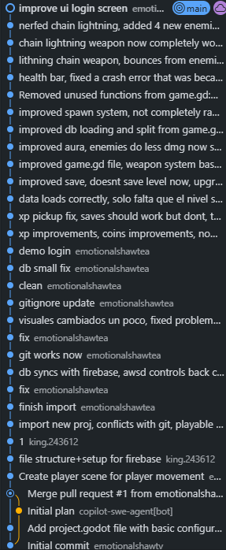

# Hunter Survivors

A 2D top-down survivor game built with Godot 4 for my end-of-year CFGs project. Basically a Vampire Survivors clone where you move around, your weapons auto-fire, and you try not to die while things get progressively harder. Has online accounts, cloud saves, and a global leaderboard through Firebase.

 **[Play it / download it here](https://matrixomfg.github.io/hunter-survivors/)**

---

## What's in it

- **Auto-combat** — weapons shoot on their own, you just focus on moving and dodging
- **Multiple weapons** — up to 3 active weapons at once, each with its own fire rate. Pistol, Shotgun, Sniper, Chain Lightning, Burst, Rocket, Boomerang
- **Passive weapons** — Aura (damage field around you) and Orbit (spinning drones)
- **6 enemy types** — Basic, Brute, Dasher, Shield Bearer, Splitter, Ghost. Each one behaves differently
- **Level ups** — collect XP orbs from dead enemies, pick upgrades every few levels (new weapon, damage boost, health, speed, etc.)
- **Difficulty ramp** — enemies spawn faster, hit harder and have more HP the longer you survive
- **Cloud saves** — your stats (coins, best score, total deaths, XP, etc.) sync to Firebase after every run
- **Global leaderboard** — top 10 scores shown on the game over screen and on the landing page
- **Accounts** — register/login with email and password

---

## How to run

### From source (Godot)

1. Clone the repo
2. Open it in **Godot 4.6+**
3. Hit **F5** or click Play
4. Make an account on the login screen and you're good to go

> Firebase is already configured and pointing to the live project, so you don't need to set anything up.

### Linux build

Download the exported build, then mark it as executable and run it:

```bash
chmod +x HunterSurvivors.x86_64
./HunterSurvivors.x86_64
```

### Windows build

Just double-click the `.exe`. If there's a `.pck` file next to it, keep both in the same folder.

---

## Controls

| Input | Action |
|---|---|
| `WASD` / Arrow keys | Move |
| `ESC` or `P` | Pause |
| Weapons fire automatically | — |

---

## Tech 

- **Engine** — Godot 4.6, GDScript
- **Backend** — Firebase Auth (login) + Firestore (saves + leaderboard)
- **Firebase addon** — [godot-firebase](https://github.com/GodotNuts/GodotFirebase) (REST-based, vendored in `/addons`)
- **Landing page** — plain HTML/CSS/JS + Firebase JS SDK, hosted on GitHub Pages

---

## Project structure

```
hunter-survivors/
├── scripts/
│   ├── core/
│   │   ├── game.gd              # main game loop
│   │   ├── settings.gd          # settings autoload (shake, post-fx, fullscreen)
│   │   ├── systems/             # spawn, level-up, difficulty, spatial hash, etc.
│   │   └── weapons/             # individual weapon class files (dead code, kept for ref)
│   ├── entities/                # player, enemies, projectile, pickup
│   ├── ui/                      # HUD, menus, login, game over, main menu
│   └── resources/               # WeaponItem resource
├── scenes/                      # Godot scene files
├── addons/godot-firebase/       # Firebase REST addon
├── docs/                        # landing page (GitHub Pages)
└── database.gd                  # Firebase Auth + Firestore autoload
```

---

## Firestore data model

```
/users/{userId}         → per-player save data (stats, progress)
/leaderboard/{userId}   → best score per player
/global_stats/summary   → aggregate counters for the landing page
```

---

## Note on commit history

The repo was fully reset on **April 22, 2026** because of some branch management issues that made things unresolvable. There were 34 commits before that point.

---

